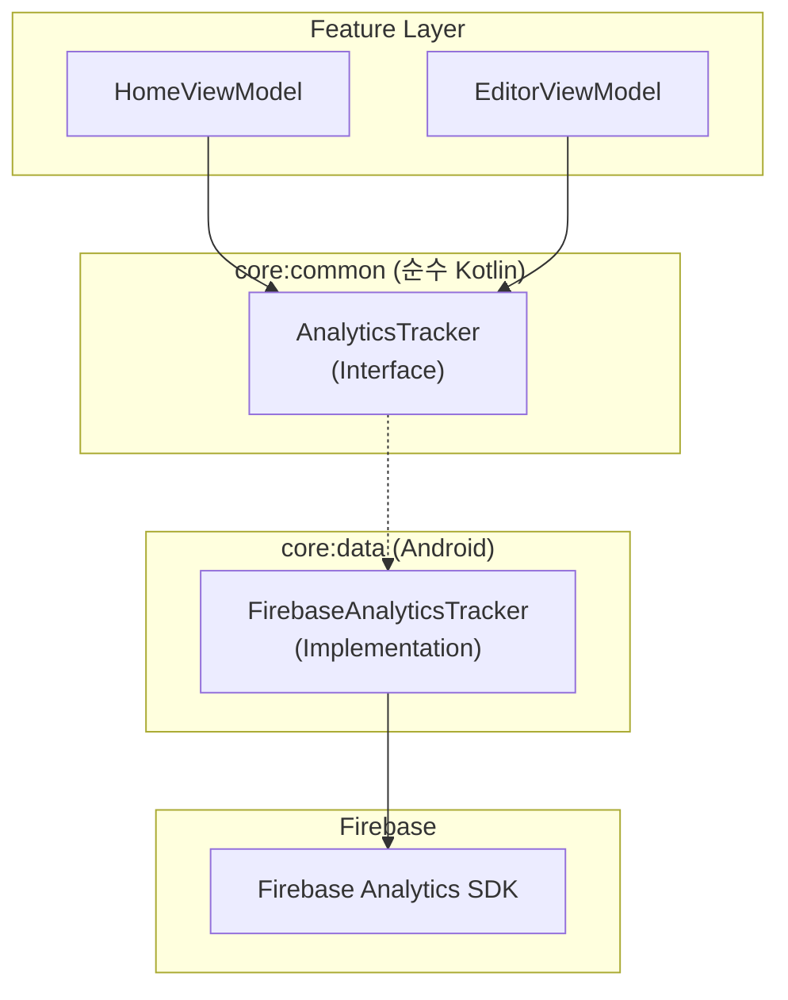

# Analytics 시스템 가이드

PDF Redactor M 애플리케이션의 Google Analytics(Firebase Analytics) 이벤트 추적 시스템에 대한 문서입니다.

## 1. 아키텍처 (Clean Architecture)

Analytics 시스템은 Logger와 동일한 Clean Architecture 패턴을 따릅니다.



### Common Layer
- **`AnalyticsTracker` 인터페이스**: Analytics 추적 기능을 추상화한 인터페이스입니다.
- 플랫폼(Android)에 독립적이며, ViewModel에서 사용됩니다.

### Data Layer
- **`FirebaseAnalyticsTracker`**: Firebase Analytics SDK를 사용한 구현체입니다.
- Android 플랫폼에 의존적입니다.

### DI (Dependency Injection)
- Hilt를 통해 `DataModule`에서 `AnalyticsTracker` 인터페이스에 `FirebaseAnalyticsTracker` 구현체를 바인딩합니다.


## 2. 추적 이벤트 목록

| 이벤트 이름 | 설명 | 파라미터 | 위치 |
|-------------|------|----------|------|
| `pro_activated` | Pro 버전 활성화 성공 | - | `HomeViewModel` |
| `open_coffeechat` | 커피챗 버튼 클릭 | - | `HomeViewModel` |
| `pii_detected_current_page` | 현재 페이지 PII 탐지 완료 | `count`, `types` | `EditorViewModel` |
| `pii_detected_all_pages` | 전체 페이지 PII 탐지 완료 | `count`, `types` | `EditorViewModel` |
| `mask_saved` | 마스킹 저장 완료 | `mask_count`, `method` | `EditorViewModel` |

### 파라미터 설명

#### `pii_detected_*` 이벤트
- `count`: 탐지된 PII 개수 (Int)
- `types`: 탐지된 PII 유형 목록, 쉼표로 구분 (String, 예: "PHONE,EMAIL,RRN")

#### `mask_saved` 이벤트
- `mask_count`: 적용된 마스크 개수 (Int)
- `method`: 마스킹 방식 - `local` (로컬 처리) 또는 `remote` (서버 API) (String)

## 3. 사용 방법

### ViewModel에서 이벤트 로깅

```kotlin
@HiltViewModel
class SampleViewModel @Inject constructor(
    private val analyticsTracker: AnalyticsTracker
) : ViewModel() {
    
    fun onSomeAction() {
        // 파라미터 없는 이벤트
        analyticsTracker.logEvent("event_name")
        
        // 파라미터가 있는 이벤트
        analyticsTracker.logEvent("event_name", mapOf(
            "param1" to "value1",
            "param2" to 123
        ))
    }
}
```

### 화면 조회 로깅

```kotlin
analyticsTracker.logScreenView("HomeScreen", "HomeScreen")
```

### 사용자 속성 설정

```kotlin
analyticsTracker.setUserProperty("is_pro_user", "true")
```

## 4. 디버깅

### 대시보드 업데이트 지연 시간

Firebase Analytics 대시보드는 실시간이 아닙니다:

| 보고서 종류 | 지연 시간 |
|-------------|-----------|
| **일반 대시보드 (Events)** | 24~48시간 |
| **DebugView** | 실시간 (몇 초) |
| **Realtime** | 몇 분 |

### Firebase DebugView 사용법

DebugView를 사용하면 이벤트를 **실시간**으로 확인할 수 있습니다.

#### 1. 디버그 모드 활성화

Android Studio 터미널 또는 명령 프롬프트에서:

```bash
adb shell setprop debug.firebase.analytics.app org.comon.pdfredactorm
```

#### 2. Firebase Console에서 확인

1. [Firebase Console](https://console.firebase.google.com) 접속
2. 프로젝트 선택
3. **Analytics** → **DebugView** 클릭
4. 앱 실행 후 이벤트 발생시키면 즉시 표시됨

#### 3. 디버그 모드 비활성화 (테스트 완료 후)

```bash
adb shell setprop debug.firebase.analytics.app .none.
```

> ⚠️ **주의**: 디버그 모드에서 발생한 이벤트는 일반 대시보드 통계에 포함되지 않습니다.

### Logcat 필터

Firebase Analytics 로그 확인:

```
tag:FA
```

## 5. 이벤트 추가 가이드

새로운 이벤트를 추가할 때:

1. **이벤트 이름**: 소문자와 언더스코어 사용 (예: `button_clicked`)
2. **파라미터 이름**: 소문자와 언더스코어 사용 (예: `button_name`)
3. **이벤트 이름 길이**: 최대 40자
4. **파라미터 개수**: 이벤트당 최대 25개
5. **파라미터 값 길이**: 문자열은 최대 100자

### 이벤트 네이밍 컨벤션

```
<object>_<action>
```

예시:
- `pdf_opened`
- `mask_saved`
- `pii_detected_current_page`
