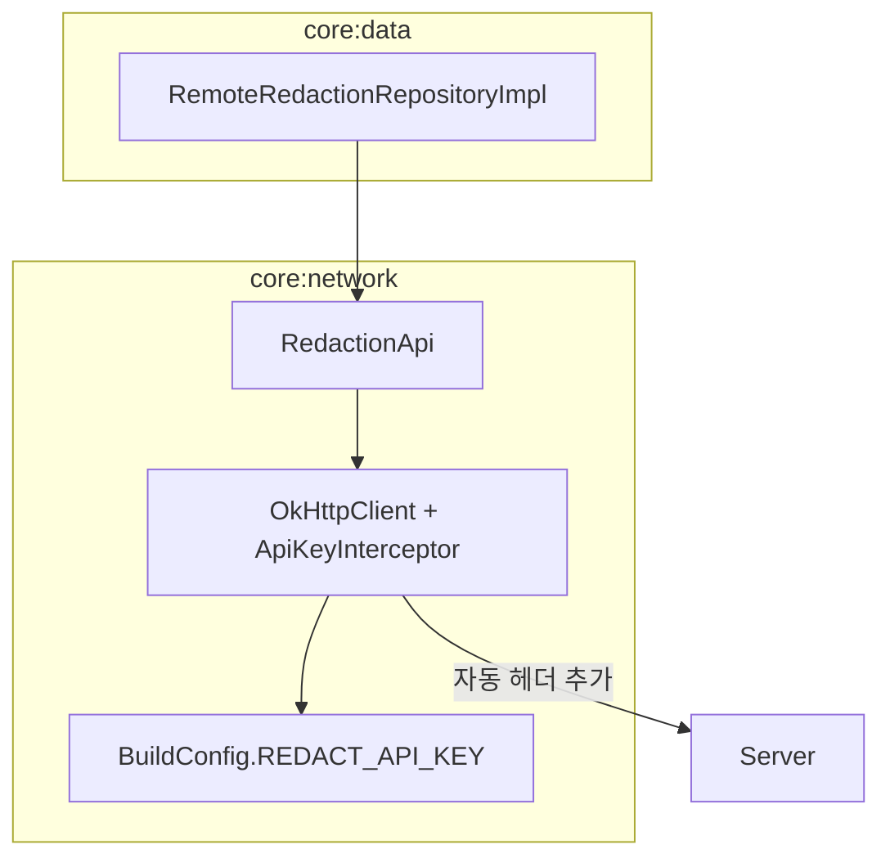

# API Key Interceptor를 활용한 헤더 자동화 리팩토링

> 작성일: 2025-12-10

## 문제점

### 기존 코드

```kotlin
// RedactionApi.kt
interface RedactionApi {
    @Multipart
    @POST("api/pdf/redact/")
    suspend fun redactPdf(
        @Header("X-Redact-Api-Key") apiKey: String,  // ❌ 매번 전달
        @Part file: MultipartBody.Part,
        @Part("redactions") redactions: RequestBody
    ): Response<ResponseBody>
}

// RemoteRedactionRepositoryImpl.kt
val response = api.redactPdf(BuildConfig.REDACT_API_KEY, filePart, redactionsPart)  // ❌ Repository에서 API 키 관리
```

### 문제 분석

| 문제 | 설명 |
|------|------|
| **관심사 혼재** | Repository가 API 키 관리라는 인프라 관심사를 담당 |
| **중복 코드** | 모든 API 호출마다 API 키를 인자로 전달해야 함 |
| **모듈 경계 위반** | API 키가 `core:data`에 정의되어 `core:network`가 역의존 |
| **변경에 취약** | API 키 전달 방식 변경 시 모든 Repository 수정 필요 |

---

## 해결

### 접근 방식

**OkHttp Interceptor 패턴**을 사용하여 각 API 호출 시 자동으로 헤더를 추가:

- 각 API용 별도의 `OkHttpClient` 생성
- Qualifier로 구분하여 Hilt DI 적용
- API 키를 `core:network` 모듈에서 통합 관리

### 수정된 코드

#### [신규] ApiKeyInterceptor.kt

```kotlin
class ApiKeyInterceptor(
    private val headerName: String,
    private val apiKey: String
) : Interceptor {
    override fun intercept(chain: Interceptor.Chain): Response {
        val request = chain.request().newBuilder()
            .addHeader(headerName, apiKey)
            .build()
        return chain.proceed(request)
    }
}
```

#### NetworkModule.kt

```kotlin
@Qualifier
annotation class RedactOkHttpClient

@Qualifier
annotation class RedeemOkHttpClient

@Provides
@RedactOkHttpClient
fun provideRedactOkHttpClient(loggingInterceptor: HttpLoggingInterceptor): OkHttpClient {
    return OkHttpClient.Builder()
        .addInterceptor(ApiKeyInterceptor("X-Redact-Api-Key", BuildConfig.REDACT_API_KEY))
        .addInterceptor(loggingInterceptor)
        .build()
}

@Provides
fun provideRedactionApi(@RedactOkHttpClient okHttpClient: OkHttpClient, json: Json): RedactionApi {
    return Retrofit.Builder()
        .baseUrl(BuildConfig.API_BASE_URL)
        .client(okHttpClient)
        .addConverterFactory(json.asConverterFactory("application/json".toMediaType()))
        .build()
        .create(RedactionApi::class.java)
}
```

#### RedactionApi.kt

```kotlin
interface RedactionApi {
    @Multipart
    @POST("api/pdf/redact/")
    suspend fun redactPdf(
        @Part file: MultipartBody.Part,  // ✅ API 키 파라미터 제거
        @Part("redactions") redactions: RequestBody
    ): Response<ResponseBody>
}
```

#### RemoteRedactionRepositoryImpl.kt

```kotlin
class RemoteRedactionRepositoryImpl @Inject constructor(
    private val api: RedactionApi,
    private val json: Json
) : RemoteRedactionRepository {

    override suspend fun redactPdf(file: File, redactions: List<RedactionMask>): Result<File> {
        // ✅ API 키 전달 없이 호출
        val response = api.redactPdf(filePart, redactionsPart)
        // ...
    }
}
```

---

## 아키텍처 구조



---

## 변경 파일 목록

| 파일 | 변경 내용 |
|------|----------|
| `core:network/build.gradle.kts` | `REDACT_API_KEY`, `REDEEM_API_KEY` buildConfigField 추가 |
| `core:data/build.gradle.kts` | API 키 관련 코드 및 buildConfig 제거 |
| `ApiKeyInterceptor.kt` | **[신규]** 헤더 자동 추가 Interceptor |
| `NetworkModule.kt` | API별 OkHttpClient 분리 + Qualifier 적용 |
| `RedactionApi.kt` | `@Header` 파라미터 제거 |
| `RedeemApi.kt` | `@Header` 파라미터 제거 |
| `RemoteRedactionRepositoryImpl.kt` | API 키 전달 코드 제거 |
| `RedeemRepositoryImpl.kt` | API 키 전달 코드 제거 |

---

## 결과

- ✅ API 키 관리가 `core:network` 모듈에 집중됨
- ✅ Repository는 순수하게 비즈니스 로직에만 집중
- ✅ 새로운 API 추가 시 Interceptor만 설정하면 됨
- ✅ API 키 전달 방식 변경 시 단일 지점만 수정
