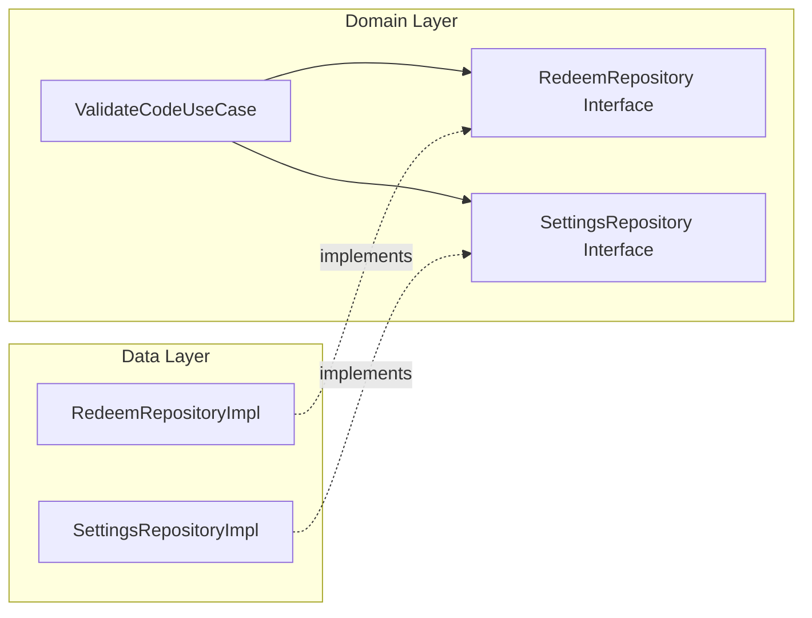

# RedeemRepository 클린 아키텍처 리팩토링

> 작성일: 2025-12-10

## 문제점

### 기존 코드

```kotlin
// RedeemRepositoryImpl.kt
class RedeemRepositoryImpl @Inject constructor(
    private val api: RedeemApi,
    private val settingsRepository: SettingsRepository  // ❌ 다른 Repository 의존
) : RedeemRepository {
    
    override suspend fun validateCode(...): Result<Boolean> {
        // ...
        if (validateResponse.isValid) {
            settingsRepository.setProEnabled(true)  // ❌ 비즈니스 로직
            Result.success(true)
        }
    }
}
```

### 문제 분석

| 문제 | 설명 |
|------|------|
| **Repository 간 의존성** | RedeemRepository가 SettingsRepository에 의존 |
| **비즈니스 로직 침투** | "검증 성공 시 Pro 활성화"는 비즈니스 규칙이며 UseCase에서 처리해야 함 |
| **단일 책임 원칙 위반** | RedeemRepository는 리딤 코드 API 호출만 책임져야 함 |
| **테스트 어려움** | Repository 테스트 시 SettingsRepository도 mock 필요 |
| **재사용성 저하** | validateCode 호출 시 항상 Pro가 활성화되어 단독 사용 불가 |

---

## 해결

### 수정된 코드

#### RedeemRepositoryImpl.kt

```kotlin
class RedeemRepositoryImpl @Inject constructor(
    private val api: RedeemApi  // ✅ API만 의존
) : RedeemRepository {
    
    override suspend fun validateCode(...): Result<Boolean> {
        // ✅ 순수하게 API 호출만 담당
        val response = api.validateCode(...)
        return if (validateResponse.isValid) {
            Result.success(true)
        } else {
            Result.failure(Exception(validateResponse.message))
        }
    }
}
```

#### ValidateCodeUseCase.kt

```kotlin
class ValidateCodeUseCase @Inject constructor(
    private val redeemRepository: RedeemRepository,
    private val settingsRepository: SettingsRepository  // ✅ UseCase에서 조율
) {
    suspend operator fun invoke(...): Result<Boolean> {
        return redeemRepository.validateCode(email, code, uuid)
            .onSuccess {
                // ✅ 비즈니스 로직: 검증 성공 시 Pro 활성화
                settingsRepository.setProEnabled(true)
            }
    }
}
```

---

## 클린 아키텍처 원칙



| 레이어 | 역할 |
|--------|------|
| **UseCase** | 비즈니스 로직 조율, 여러 Repository 결과 조합 |
| **Repository** | 단일 데이터 소스에 대한 CRUD, DTO ↔ Domain 변환 |

---

## 결과

- ✅ 각 레이어의 책임이 명확해짐
- ✅ Repository가 다른 Repository에 의존하지 않음
- ✅ 테스트 시 개별 컴포넌트 mock 용이
- ✅ validateCode() 함수 단독 재사용 가능
