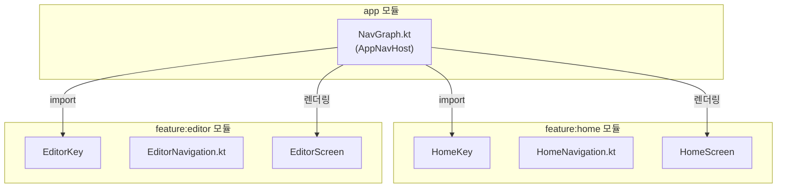
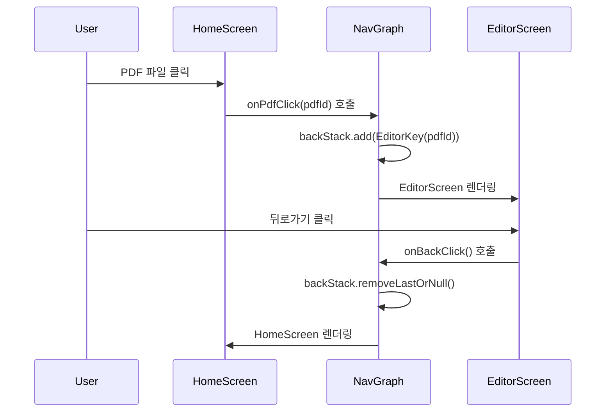
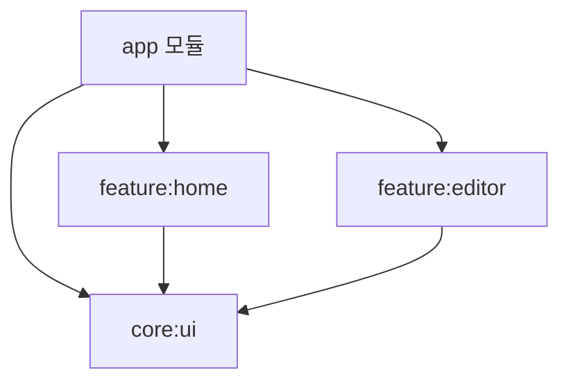

# 네비게이션 아키텍처

본 프로젝트는 **Navigation3** 라이브러리를 사용하여 Compose 기반 네비게이션을 구현합니다.

## 개요



---

## 핵심 컴포넌트

### 1. NavKey (화면 식별자)

각 화면은 고유한 `NavKey`를 가집니다. Navigation3에서 화면 전환 시 이 키를 사용합니다.

| 파일 | 키 | 용도 |
|------|-----|------|
| `feature/home/navigation/HomeRoute.kt` | `HomeKey` | 홈 화면 (PDF 목록) |
| `feature/editor/navigation/EditorRoute.kt` | `EditorKey(pdfId)` | PDF 편집 화면 |

```kotlin
// HomeRoute.kt
@Serializable
data object HomeKey : NavKey

// EditorRoute.kt
@Serializable
data class EditorKey(val pdfId: String) : NavKey
```

> [!NOTE]
> `@Serializable` 어노테이션은 Navigation3의 백스택 상태 저장/복원에 필요합니다.

---

### 2. App 모듈 - NavGraph.kt

**역할**: 앱 전체 네비게이션의 **중앙 허브**

```kotlin
@Composable
fun AppNavHost() {
    val backStack = rememberNavBackStack(HomeKey)  // 초기 화면: Home
    
    NavDisplay(
        backStack = backStack,
        entryProvider = entryProvider {
            entry<HomeKey> { /* HomeScreen 렌더링 */ }
            entry<EditorKey> { key -> /* EditorScreen 렌더링 */ }
        }
    )
}
```

**주요 책임:**
- 백스택(`backStack`) 관리
- 화면 전환 로직 (`backStack.add()`, `backStack.removeLastOrNull()`)
- BuildConfig 값 주입 (광고 ID, URL 등)
- 모든 feature 화면 통합

---

### 3. Feature 모듈 - Navigation 파일

**역할**: 재사용 가능한 네비게이션 컴포넌트 제공

| 파일 | 내용 |
|------|------|
| `HomeNavigation.kt` | `homeEntry()` 헬퍼 함수 |
| `EditorNavigation.kt` | `editorEntry()` 헬퍼 함수 |

```kotlin
// EditorNavigation.kt
@Composable
fun editorEntry(
    key: EditorKey,
    onBackClick: () -> Unit
): NavEntry<EditorKey> = NavEntry(key) {
    ScopedViewModelContainer {
        EditorScreen(pdfId = key.pdfId, onBackClick = onBackClick)
    }
}
```

> [!TIP]
> 현재 `NavGraph.kt`에서 직접 화면을 정의하고 있어 이 헬퍼 함수들은 사용되지 않습니다.
> 다른 앱에서 feature 모듈을 재사용할 때 유용합니다.

---

## 화면 전환 흐름



---

## ViewModel 스코프 관리

`EditorScreen`은 `ScopedViewModelContainer`로 감싸져 있습니다:

```kotlin
entry<EditorKey> { key ->
    ScopedViewModelContainer {
        EditorScreen(...)
    }
}
```

**이유**: Editor 화면에 진입할 때마다 새로운 ViewModel을 생성하여 이전 상태가 남아있지 않도록 합니다.

---

## 모듈 의존성



| 모듈 | 네비게이션 관련 책임 |
|------|---------------------|
| `app` | NavGraph 정의, 백스택 관리, 화면 조립 |
| `feature:home` | HomeKey 정의, HomeScreen 제공 |
| `feature:editor` | EditorKey 정의, EditorScreen 제공 |
| `core:ui` | ScopedViewModelContainer 제공 |

---

## 파일 위치 요약

```
app/
└── src/main/java/.../presentation/navigation/
    └── NavGraph.kt              # 메인 네비게이션 허브

feature/
├── home/
│   └── src/main/java/.../navigation/
│       ├── HomeRoute.kt         # HomeKey 정의
│       └── HomeNavigation.kt    # homeEntry() 헬퍼
│
└── editor/
    └── src/main/java/.../navigation/
        ├── EditorRoute.kt       # EditorKey 정의
        └── EditorNavigation.kt  # editorEntry() 헬퍼

core/
└── ui/
    └── src/main/java/.../
        └── ScopedViewModelContainer.kt  # ViewModel 스코프 관리
```

---

## 새 화면 추가 가이드

1. **NavKey 정의** (feature 모듈)
   ```kotlin
   // feature/settings/navigation/SettingsRoute.kt
   @Serializable
   data object SettingsKey : NavKey
   ```

2. **Screen Composable 생성** (feature 모듈)
   ```kotlin
   // feature/settings/SettingsScreen.kt
   @Composable
   fun SettingsScreen(onBackClick: () -> Unit) { ... }
   ```

3. **NavGraph에 entry 추가** (app 모듈)
   ```kotlin
   // NavGraph.kt
   entry<SettingsKey> {
       SettingsScreen(onBackClick = { backStack.removeLastOrNull() })
   }
   ```

4. **화면 전환 로직 추가**
   ```kotlin
   // HomeScreen에서 Settings로 이동
   onSettingsClick = { backStack.add(SettingsKey) }
   ```
