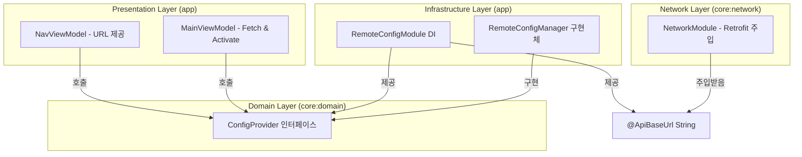

# Firebase Remote Config 가이드

이 문서는 PDF Redactor M 프로젝트에서 Firebase Remote Config를 사용하여 동적 설정(특히 API URL)을 관리하는 방법에 대해 설명합니다.

## 📋 개요

앱 업데이트 없이 원격으로 설정을 변경하기 위해 Firebase Remote Config를 도입했습니다. 클린 아키텍처 원칙을 준수하기 위해 인터페이스를 분리하고 의존성 역전 원칙(DIP)을 적용했습니다.

### 주요 관리 대상
- `api_base_url`: Retrofit API 통신을 위한 기본 URL
- `coffee_chat_url`: 앱 내 후원/커피챗 링크 URL

---

## 🏗 아키텍처 구조



---

## 🛠 주요 컴포넌트

### 1. ConfigProvider (Interface)
`core:domain` 모듈에 위치하며, 플랫폼 독립적인 설정 인터페이스를 정의합니다.

```kotlin
interface ConfigProvider {
    suspend fun fetchAndActivate(): Boolean
    fun getApiBaseUrl(): String
    fun getCoffeeChatUrl(): String
}
```

### 2. RemoteConfigManager (Implementation)
`app` 모듈에 위치하며, Firebase SDK를 사용하여 설정을 가져옵니다. 
- **빌드 타입 대응**: 디버그 모드에서는 fetch 간격을 0초로 설정하여 즉시 반영되도록 합니다. 
- **기본값**: Firebase fetch 실패 시 `BuildConfig`에 정의된 기본값을 사용합니다.

### 3. RemoteConfigModule (DI)
Hilt를 통해 의존성을 제공합니다. `ConfigProvider`를 Singleton으로 제공하며, 특정 URL을 위한 Qualifier(`@ApiBaseUrl`, `@CoffeeChatUrl`)를 제공합니다.

---

## 🚀 워크플로우

1. **초기화 (Splash Screen)**
   - `MainViewModel`의 `init` 블록에서 `configProvider.fetchAndActivate()`를 호출합니다.
   - 설정 로딩이 완료될 때까지 Splash Screen이 유지됩니다.
   
2. **URL 주입**
   - **Network**: `NetworkModule`에서 `@ApiBaseUrl apiBaseUrl: String`을 주입받아 Retrofit 인스턴스를 생성합니다.
   - **Navigation**: `NavViewModel`이 `ConfigProvider`를 통해 URL을 가져와 `NavGraph`에 전달합니다.

---

## ⚙️ Firebase Console 설정

Firebase Console에서 다음 파라미터를 추가해야 정상적으로 동작합니다.

| Parameter Key | Default Value (예시) | Description |
| :--- | :--- | :--- |
| `api_base_url` | `https://comon.dev/api/` | 서버 API 통신 경로 |
| `coffee_chat_url` | `https://comon.dev/api/` | 후원 링크 |

### 설정 방법
1. Firebase Console > Remote Config 접속
2. 파라미터 추가 및 값 입력
3. **변경사항 게시(Publish Changes)** 클릭

---

## 📝 개발 참고 사항

### 의존성 관리
- `firebase-config` 라이브러리를 사용합니다. 
- KSP 빌드 이슈 방지를 위해 인터페이스는 `core:domain` 모듈에 위치시킵니다.

### 로컬 기본값
`app/build.gradle.kts`에서 `local.properties`의 값을 읽어 `DEFAULT_API_BASE_URL` 등을 `BuildConfig` 필드로 생성합니다. 이는 네트워크가 없는 환경이나 Remote Config 초기화 전의 안전장치 역할을 합니다.
